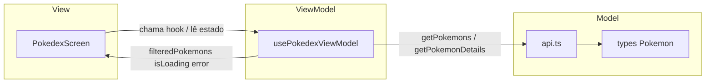

# Proposta de refatoração — `PokedexScreen` (Aula 05)

## 1. Padrão escolhido: **MVVM**

**Justificativa:** em React Native com hooks, o **ViewModel** costuma ser materializado como um hook (`usePokedexViewModel`) que concentra estado, efeitos colaterais e derivações. A **View** (`PokedexScreen.tsx`) permanece principalmente declarativa (JSX + ligação de eventos). Isso espelha bem a separação **Model** (dados da API + tipos) / **View** / **ViewModel** sem a cerimônia extra de interfaces de view do **MVP**, que em ecossistema React é mais comum com classes ou camadas imperativas explícitas.

---

## 2. Nova estrutura de arquivos (exemplo)

```text
PokedexApp/
├─ src/
│  ├─ screens/
│  │  └─ Pokedex/
│  │     ├─ PokedexScreen.tsx           View (apresentação + wiring mínimo)
│  │     └─ usePokedexViewModel.ts    ViewModel (estado, efeitos, ações)
│  ├─ components/
│  │  └─ PokemonCard.tsx
│  ├─ services/
│  │  └─ api.ts
│  ├─ types/
│  │  └─ Pokemon.ts
│  └─ utils/
│     └─ format.ts
```

Opcionalmente, testes colados à feature:

```text
│  └─ Pokedex/
│     ├─ PokedexScreen.tsx
│     ├─ usePokedexViewModel.ts
│     └─ usePokedexViewModel.test.ts
```

---

## 3. Divisão de responsabilidades

### View — `PokedexScreen.tsx`

- Renderiza **layout**: título, `TextInput`, `ActivityIndicator`, mensagens de erro/vazio, `FlatList`.  
- Consome apenas o retorno do hook: **dados e callbacks** já prontos.  
- Não contém `useEffect` de fetch nem regra de filtro; pode manter apenas ajustes puramente visuais (ex. `useSafeAreaInsets` aplicado ao container).

**Exemplo de consumo (conceitual):**

```tsx
const vm = usePokedexViewModel();

return (
  <View style={[styles.container, { paddingTop: insets.top }]}>
    <Text style={styles.title}>Pokédex</Text>
    <TextInput
      value={vm.searchQuery}
      onChangeText={vm.setSearchQuery}
      placeholder="Buscar..."
    />
    {vm.isLoading ? <ActivityIndicator /> : vm.error ? <Text>{vm.error}</Text> : (
      <FlatList
        data={vm.filteredPokemons}
        keyExtractor={(item) => item.id.toString()}
        renderItem={({ item }) => <PokemonCard pokemon={item} onPress={() => vm.onPokemonPress(item)} />}
      />
    )}
  </View>
);
```

*(O `onPokemonPress` delegaria à navegação injetada ou a um callback passado ao hook, mantendo a View fina.)*

### ViewModel — `usePokedexViewModel.ts`

**Estado exposto (exemplos):**

| Estado / valor derivado | Papel |
|-------------------------|--------|
| `pokemons: Pokemon[]` | Lista carregada da API após enriquecimento com detalhes. |
| `searchQuery: string` | Texto do campo de busca. |
| `isLoading: boolean` | Carregamento inicial (e opcionalmente recargas). |
| `error: string \| null` | Mensagem amigável ao usuário. |
| `filteredPokemons` | Lista derivada: `useMemo` aplicando filtro sobre `pokemons` e `searchQuery`. |

**Funções expostas:**

- `setSearchQuery(query: string)` — atualiza busca (pode debounce opcional aqui).  
- `refetch()` (opcional) — nova carga da lista.  
- `onPokemonPress(pokemon: Pokemon)` — dispara navegação para detalhes com params tipados.

**Lógica que **migra** da tela para o ViewModel:**

- `useEffect` que chama `getPokemons` + `Promise.all` de `getPokemonDetails`.  
- Tratamento `try/catch/finally` e mensagens de erro.  
- Cálculo da lista filtrada.

O **Model** continua sendo `api.ts` + tipos `Pokemon`; o ViewModel **orquestra** chamadas ao Model e expõe o que a View precisa.

---

## 4. Fluxo de dados — usuário digita na busca

1. O usuário digita no `TextInput` da **View**.  
2. O `onChangeText` chama **`setSearchQuery`** do ViewModel.  
3. O estado `searchQuery` atualiza; o React re-renderiza o componente que usa o hook.  
4. O ViewModel recalcula **`filteredPokemons`** via `useMemo` (dependências: `pokemons`, `searchQuery`).  
5. A **View** repassa `filteredPokemons` ao `FlatList`; a lista exibe só os itens que passam no filtro.  
6. **Nenhuma nova requisição** à API é necessária apenas por digitar — o fluxo é síncrono em cima dos dados já carregados (comportamento equivalente ao atual, porém encapsulado no ViewModel).

**Fluxo opcional com debounce:** dentro do ViewModel, `searchQuery` interno atualiza imediatamente e um `debouncedQuery` (outro estado atualizado com atraso) alimenta o `useMemo` do filtro, reduzindo trabalho se o filtro ficar mais pesado no futuro.

---

## Diagrama simplificado (MVVM na Pokédex)



